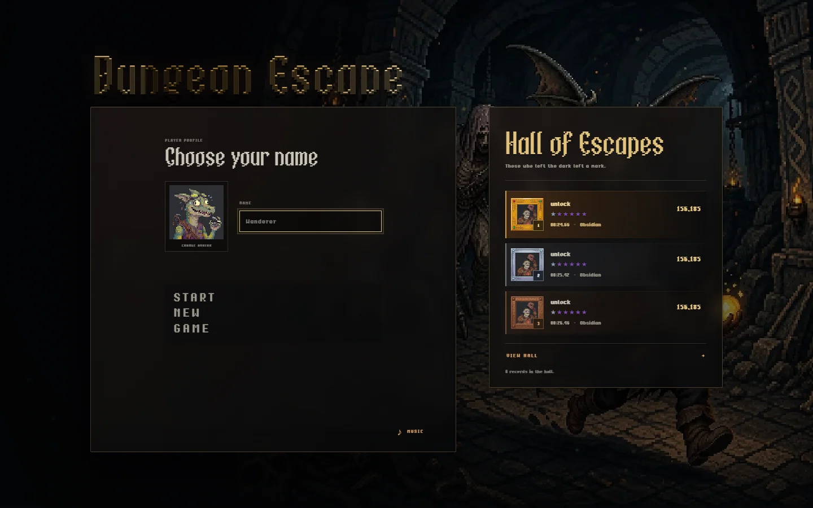
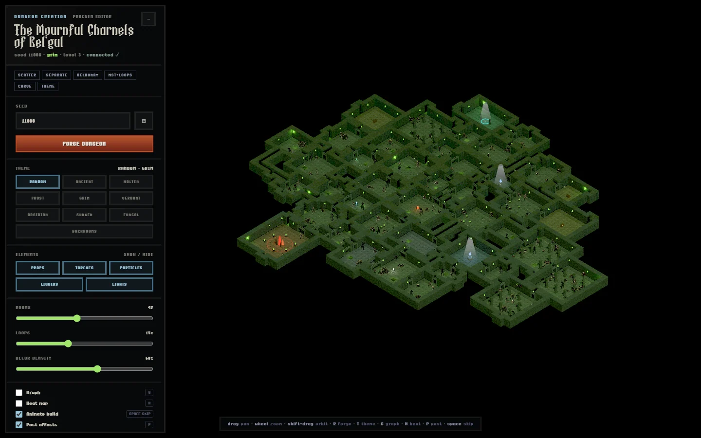
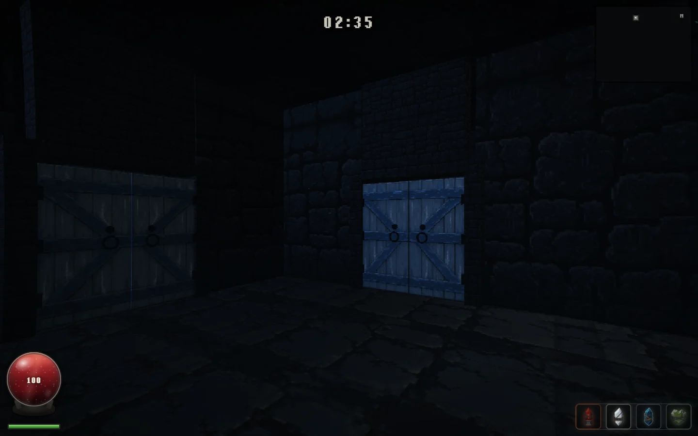
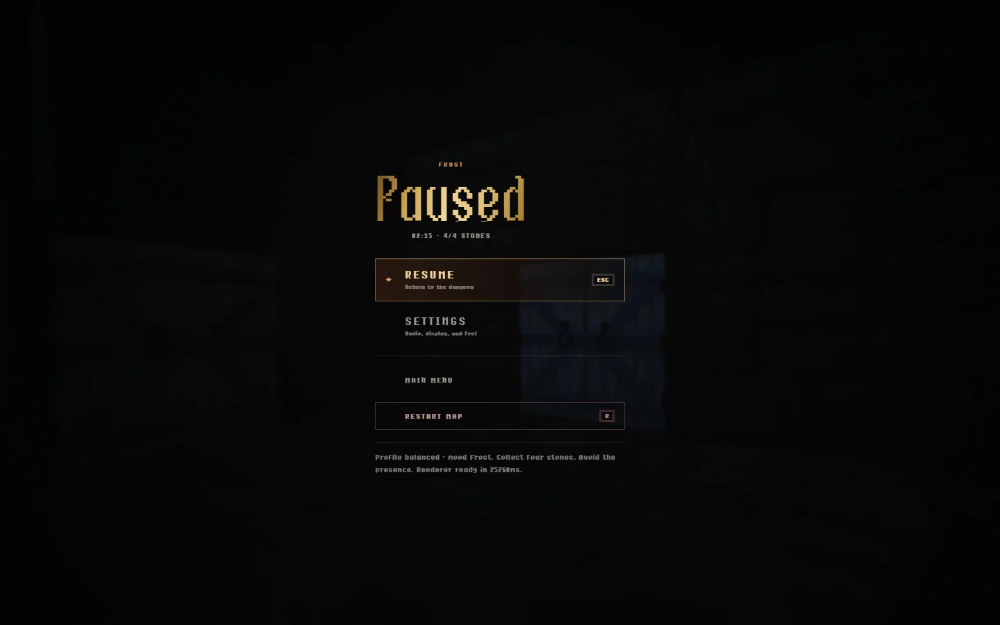

<p align="center">
  <picture>
    <source media="(prefers-color-scheme: dark)" srcset="https://shieldcn.dev/header/document.svg?title=Dungeon+Escape&subtitle=Forge+the+maze.+Survive+the+descent.&logo=gamepad2&theme=orange&align=center&mode=dark" />
    
  </picture>
</p>

> A first-person generated dungeon with seeded campaigns, eleven biomes, a visual map Forge, spatial audio, and local run saves.

<p align="center">
  <a href="https://github.com/gvastethecreator/dungeon-escape/actions/workflows/ci.yml"></a>
  <a href="https://dungeon.gvaste.ar"></a>
  <a href="https://gvastethecreator.github.io/dungeon-escape/"></a>
  <a href="#renderer-boundary"></a>
  <a href="https://github.com/gvastethecreator/dungeon-escape/stargazers"></a>
  <a href="LICENSE"></a>
</p>

[Play now](https://dungeon.gvaste.ar) · [Project site](https://gvastethecreator.github.io/dungeon-escape/) · [Development](docs/DEVELOPMENT.md) · [Contributing](CONTRIBUTING.md)

## Tour

| Welcome and Hall of Escapes                                                                       | Procedural map Forge                                                                  |
| ------------------------------------------------------------------------------------------------- | ------------------------------------------------------------------------------------- |
|  |  |
| **Frost run · WebGL2**                                                                            | **Pause and run ledger**                                                              |
|   |         |

The screenshots were captured from isolated local QA profiles with WebGL2 explicitly selected. They contain no personal save data or production credentials.

## Play

Start a seeded campaign in the browser. Choose a biome, collect four stones, find the portal, and leave a mark in the Hall of Escapes. Keyboard, mouse, and touch controls share the same run rules.

Use **Custom Run** to open the Forge editor and inspect or reshape a generated map before entering it.

## Quick start

Requires Bun 1.3.14 or later and a current Chrome, Edge, or Firefox browser.

```bash
bun install --frozen-lockfile
bun run dev
```

Open `http://127.0.0.1:24211/`. Use **New Game** for a campaign run or **Custom Run** for the Forge.

## What is included

- Seeded dungeon layouts with local replayable saves
- Eleven biome identities with enemies, props, hazards, and spatial audio
- First-person keyboard, mouse, and touch play
- A procedural map Forge and in-game minimap
- Local-first player state plus an optional authority-service boundary
- A Cloudflare Worker and D1 path for the Hall of Escapes

## Renderer boundary

WebGL2 remains the automatic default and the public visual baseline. WebGPU is available only through `?renderer=webgpu` while its TSL parity and human acceptance gates remain open. Do not infer a default flip from an opt-in capture or focused test result; see [ADR 0009](docs/adr/0009-webgpu-renderer-and-tsl.md).

## Documentation

- [Development](docs/DEVELOPMENT.md)
- [Standalone architecture](docs/STANDALONE.md)
- [Audio runtime](docs/AUDIO.md)
- [Hall of Escapes](docs/LEADERBOARD.md)
- [Dependencies](docs/DEPENDENCIES.md)
- [Security policy](SECURITY.md)
- [Third-party notices](THIRD_PARTY_NOTICES.md)

## Attribution

The map generator is a modified version of [Majid Manzarpour's threejs-procedural-dungeon](https://github.com/majidmanzarpour/threejs-procedural-dungeon). See [THIRD_PARTY_NOTICES.md](THIRD_PARTY_NOTICES.md) for the upstream MIT notice.

## Support

If Dungeon Escape earns another run, you can support continued development through [GitHub Sponsors](https://github.com/sponsors/gvastethecreator) or [Ko-fi](https://ko-fi.com/gvaste).

## License

MIT. See [LICENSE](LICENSE). Upstream map-generator portions retain their own MIT notice in [THIRD_PARTY_NOTICES.md](THIRD_PARTY_NOTICES.md).
